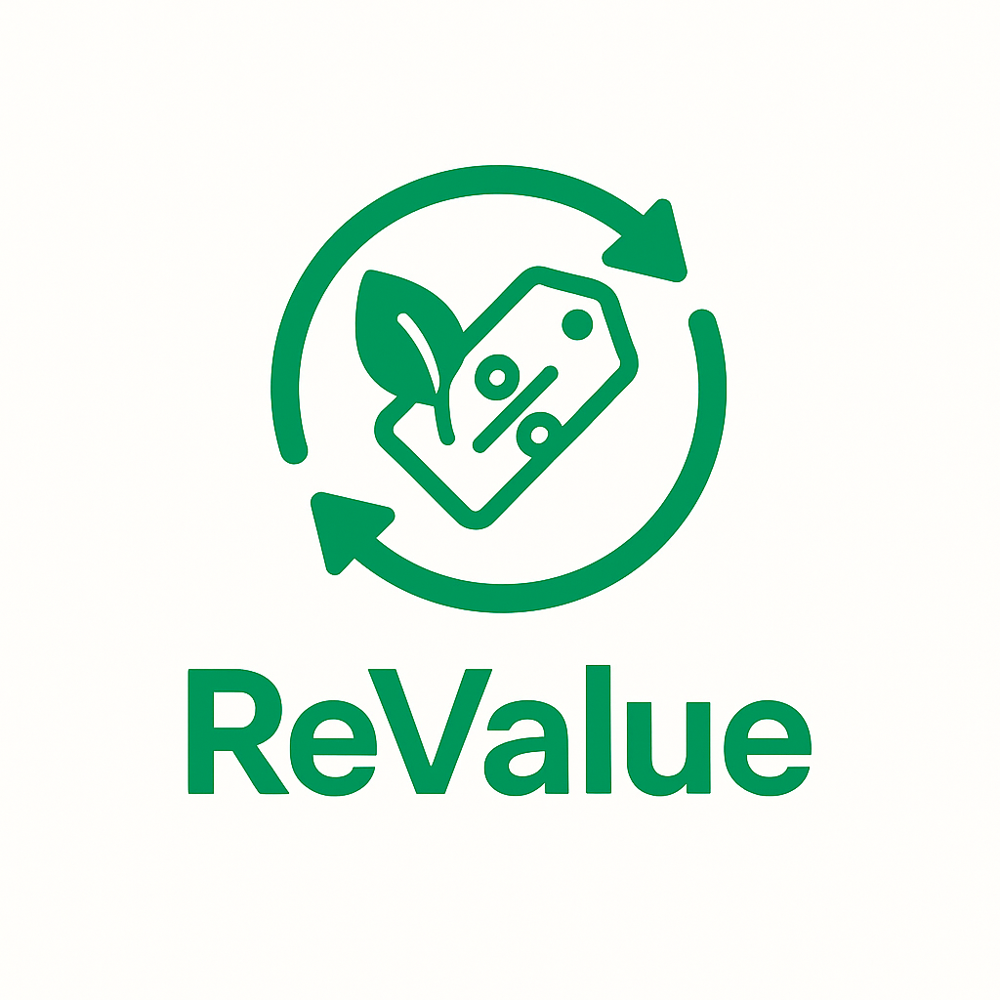

# 🌱 ReValue

<div align="center">
  
  
  ### 지구를 지키는 떨이 플랫폼
  
  [](https://reactnative.dev/)
  [](https://expo.dev/)
  [](https://firebase.google.com/)
  [](https://www.typescriptlang.org/)
  [](LICENSE)

  **환경을 생각하는 스마트 소비의 시작**
</div>

---

## 📱 프로젝트 소개

**ReValue**는 잉여 재고를 가진 매장과 할인된 가격으로 제품을 구매하려는 소비자를 연결하는 모바일 플랫폼입니다. 

- 🌍 **환경 보호**: 음식물 쓰레기와 재고 낭비를 줄여 지구를 보호합니다
- 💰 **경제적 혜택**: 소비자는 할인된 가격으로, 매장은 손실을 최소화
- 📍 **위치 기반**: 실시간 지도에서 주변 매장의 "떨이" 상품을 확인
- 🔔 **스마트 알림**: 관심 매장과 상품의 업데이트를 놓치지 마세요

## ✨ 주요 기능

### 🛍️ 구매자 기능
- **실시간 떨이 탐색**: 
  - 지도에서 주변 매장의 할인 상품 확인
  - 경로 기반 추천 (출퇴근길 떨이)
  - 5분 거리 내 떨이 필터
  - 지역별 인기 매장/랭킹
  - 신규 입점 매장 하이라이트
- **스마트 필터링**: 
  - 테마별/가격대별/카테고리별 필터
  - 할인율 기준 정렬
  - 태그 기반 검색
- **커뮤니티**:
  - 떨이 꿀팁 공유
  - 지역별 맛집 정보
  - 환경 보호 실천 사례
- **리뷰 시스템**:
  - 사진 리뷰 보상
  - 상세 평가 (신선도, 가격 만족도, 서비스)
  - 인기 리뷰어 뱃지
- **환경 보호 캠페인**:
  - 에코 포인트 시스템
  - 환경 보호 효과 시각화
  - 나무 심기 프로젝트

### 🏪 판매자 기능
- **스마트 대시보드**:
  - 재고 관리
  - 판매 예측 분석
  - 최적 할인율 추천
  - 시간대별 매출 분석
  - 경쟁사 가격 동향
- **고객 관리**:
  - 단골 고객 관리
  - 맞춤형 프로모션
  - 고객 데이터 분석
- **간편한 상품 등록**:
  - 직관적인 UI
  - 가격/할인율 슬라이더
  - 이미지 업로드 프리뷰
  - 수량 간편 조정

### 💳 결제/주문 시스템
- **간편 주문**: 원터치 예약
- **빠른 재주문**: 자주 구매하는 상품
- **스마트 알림**:
  - 예약 시간 도착 알림
  - 선호 매장 신규 떨이
  - 마감 임박 할인

## 🎨 디자인 특징
- **Toss 스타일 UI**:
  - 레드/화이트 기반 컬러 시스템
  - 미니멀한 디자인
  - 직관적인 인터페이스
- **모션 디자인**:
  - 부드러운 전환 효과
  - 마이크로 인터랙션
  - 로딩 애니메이션
- **접근성**:
  - 고대비 모드
  - 글자 크기 조절
  - 음성 안내

## 🛠️ 기술 스택

### Frontend
- **React Native** + **Expo** - 크로스 플랫폼 모바일 개발
- **TypeScript** - 타입 안전성
- **Expo Router** - 파일 기반 라우팅
- **React Native Maps** - 지도 기능
- **Expo Location** - 위치 기반 서비스
- **Expo Notifications** - 푸시 알림
- **Expo ImagePicker** - 이미지 선택/압축
- **React Native Gifted Charts** - 데이터 시각화

### Backend
- **Firebase Authentication** - 사용자 인증
- **Firestore** - NoSQL 데이터베이스
- **Firebase Storage** - 이미지 저장
- **Firebase Cloud Messaging** - 푸시 알림 서버
- **Firestore Indexes** - 쿼리 최적화

### UI/UX
- **커스텀 컴포넌트** - 일관된 디자인 시스템
- **Toss 스타일 테마** - 모던한 UI/UX
- **반응형 디자인** - 다양한 화면 크기 지원
- **애니메이션** - 부드러운 사용자 경험

## 🚀 시작하기

### 전제 조건
- Node.js 18+ 
- npm 또는 yarn
- Expo CLI
- iOS Simulator (macOS) 또는 Android Emulator

### 설치 및 실행

1. **저장소 클론**
   ```bash
   git clone https://github.com/seokjun4321/ReValue.git
   cd ReValue
   ```

2. **의존성 설치**
   ```bash
   npm install
   ```

3. **개발 서버 시작**
   ```bash
   npx expo start
   ```

4. **앱 실행**
   - **모바일**: Expo Go 앱으로 QR 코드 스캔
   - **iOS 시뮬레이터**: `i` 키 입력
   - **Android 에뮬레이터**: `a` 키 입력
   - **웹 브라우저**: `w` 키 입력

## 📁 프로젝트 구조

```
ReValue/
├── 📱 app/                    # 메인 앱 화면들
│   ├── (tabs)/               # 탭 네비게이션 화면
│   │   ├── home.tsx         # 홈 화면
│   │   ├── mapscreen.tsx    # 지도 화면  
│   │   ├── favorites.tsx    # 찜 목록
│   │   ├── community.tsx    # 커뮤니티
│   │   └── profile.tsx      # 프로필
│   ├── seller/              # 판매자 전용 화면
│   │   ├── upload.tsx       # 떨이 등록
│   │   ├── dashboard.tsx    # 판매자 대시보드
│   │   └── store/          # 매장 관리
│   ├── admin/              # 관리자 화면
│   ├── _layout.tsx         # 루트 레이아웃
│   └── index.tsx           # 로그인 화면
├── 🧩 components/           # 재사용 컴포넌트
│   ├── common/             # 공통 컴포넌트
│   │   ├── AccessibilityManager.tsx
│   │   ├── AnimatedButton.tsx
│   │   ├── LoadingIndicator.tsx
│   │   └── Skeleton.tsx
│   ├── AddressSearch.tsx   # 주소 검색
│   ├── PersonalizedFeed.tsx # 개인화 피드
│   ├── ShareButton.tsx     # 공유 버튼
│   ├── SmartSearch.tsx     # 스마트 검색
│   └── StoreRecommendation.tsx # 매장 추천
├── 🔧 lib/                  # 유틸리티 & 로직
│   ├── firestore.ts        # Firestore 함수들
│   ├── notifications.ts    # 푸시 알림 관리
│   ├── socialAuth.ts       # 소셜 로그인
│   ├── types.ts           # TypeScript 타입 정의
│   ├── designSystem.ts    # 디자인 시스템
│   ├── personalization.ts # 개인화 로직
│   └── userUtils.ts       # 사용자 유틸리티
├── 🎨 assets/              # 정적 자원
│   └── images/            # 이미지 파일들
├── 📄 firestore.indexes.json # Firestore 인덱스
└── ⚙️ app.json            # Expo 설정
```

## 📈 개발 로드맵

### ✅ 완료된 기능
- [x] 기본 앱 구조 및 네비게이션
- [x] Firebase 인증 및 데이터베이스
- [x] 지도 기반 매장 탐색
- [x] 찜 기능 및 알림 설정
- [x] 판매자 대시보드
- [x] 소셜 로그인 (Google)
- [x] 커뮤니티 기능
- [x] 리뷰 시스템
- [x] 환경 보호 캠페인
- [x] Toss 스타일 UI/UX
- [x] 위치 기반 서비스 개선

### 🚧 진행 중
- [ ] 카카오/네이버 소셜 로그인
- [ ] 실제 결제 시스템 연동
- [ ] Firestore 인덱스 최적화
- [ ] 성능 최적화

### 🎯 향후 계획
- [ ] AI 추천 시스템
- [ ] 배달 서비스 연동
- [ ] B2B 대량 거래 플랫폼
- [ ] 탄소 중립 인증 시스템

## 🤝 기여하기

ReValue 프로젝트에 기여해 주세요!

1. Fork the Project
2. Create your Feature Branch (`git checkout -b feature/AmazingFeature`)
3. Commit your Changes (`git commit -m 'Add some AmazingFeature'`)
4. Push to the Branch (`git push origin feature/AmazingFeature`)
5. Open a Pull Request

## 📄 라이선스

이 프로젝트는 MIT 라이선스 하에 배포됩니다. 자세한 내용은 [LICENSE](LICENSE) 파일을 참조하세요.

## 📞 연락처

**개발팀 ReValue**
- 📧 Email: contact@revalue.app
- 🐙 GitHub: [@seokjun4321](https://github.com/seokjun4321)
- 💼 LinkedIn: [ReValue Official](https://linkedin.com/company/revalue)

---

<div align="center">
  <p><strong>🌍 함께 만들어가는 지속가능한 미래</strong></p>
  <p>ReValue와 함께 환경을 보호하고 현명한 소비를 실천해보세요!</p>
  
  [](https://github.com/seokjun4321/ReValue)
</div>